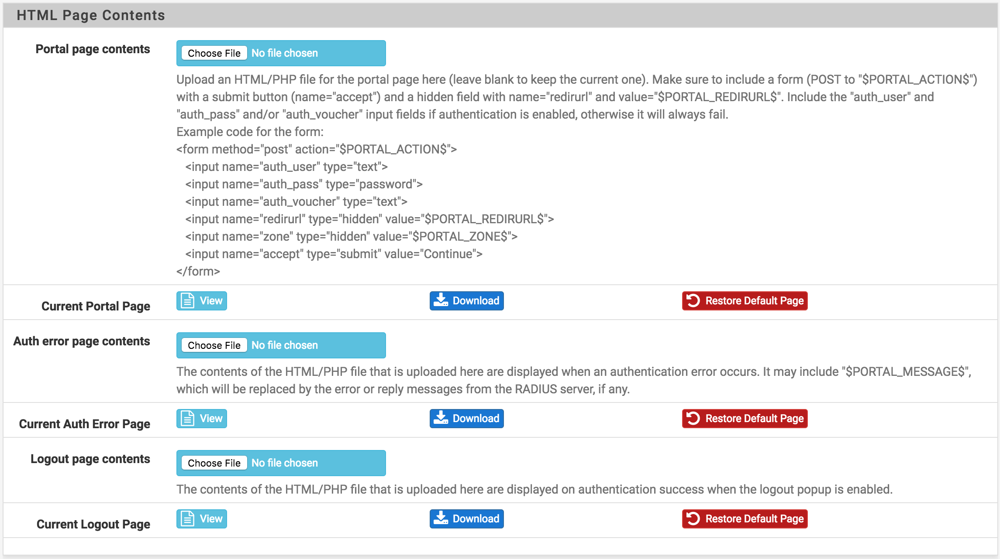

# pfSense Captive Portal

Get rid of the boring default pfSense display and swap it out for a pretty and responsive page.

## Themes

Vanilla - [Source](https://github.com/kobaltz/pfsense_captive_portal/tree/gh-pages/vanilla) - [Example](https://kobaltz.github.io/pfsense_captive_portal/vanilla/login-username-password.html)

Azmind -  - [Source](https://github.com/kobaltz/pfsense_captive_portal/tree/gh-pages/azmind) - [Example](https://kobaltz.github.io/pfsense_captive_portal/azmind/login-username-password.html)

## Installing

Log into your pfSense dashboard and go to Services > Captive Portal.

Edit your Captive Portal and upload each of the HTML files in this repository to the appropriate places.

  - Portal Page Contents -> login.html
  - Auth error page contents -> error.html
  - Logout page contents -> logout.html

