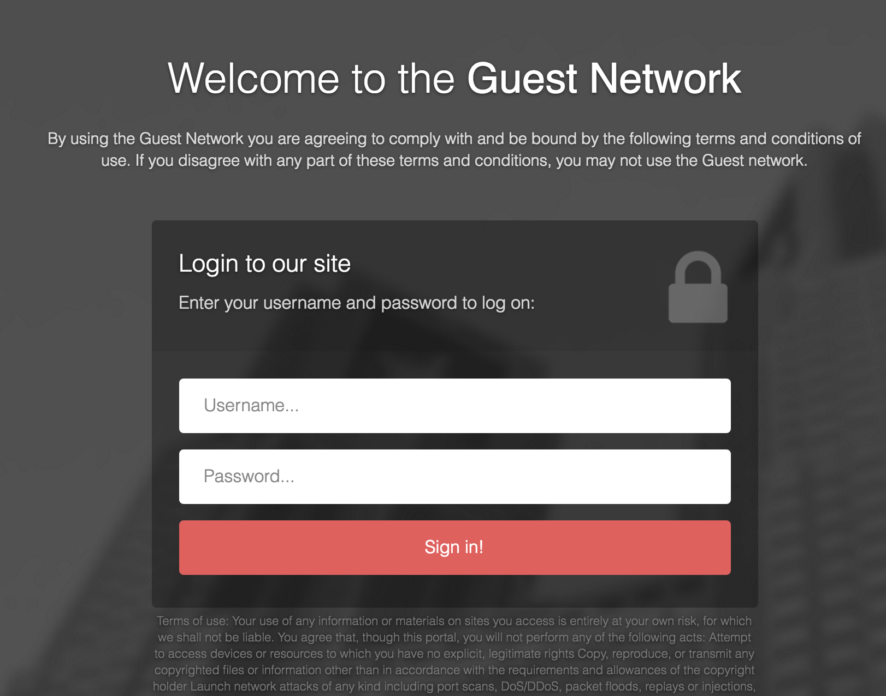

# pfSense Captive Portal

https://kobaltz.github.io/pfsense_captive_portal/azmind/login-username-password.html

Keep in mind that this theme is much heavier than the vanilla. It weights about 250KB, but this should not be a problem for the Captive Portal.

## Files

Included in the Azmind styles is seven files. You will only need three of them. Pick the ones that matches your configuration:

### Username/Password
 - login-username-password.html
 - error-username-password.html
 - logout.html

### Username/Password or Token
 - login-username-password-token.html
 - error-username-password-token.html
 - logout.html

### Token
 - login-token.html
 - error-token.html
 - logout.html 

## Installing

Log into your pfSense dashboard and go to Services > Captive Portal.

Edit your Captive Portal and upload each of the HTML files in this repository to the appropriate places.

  - Portal Page Contents -> login-username-password.html
  - Auth error page contents -> error-username-password.html
  - Logout page contents -> logout.html

